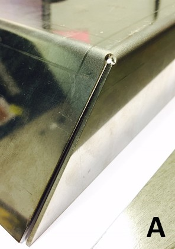
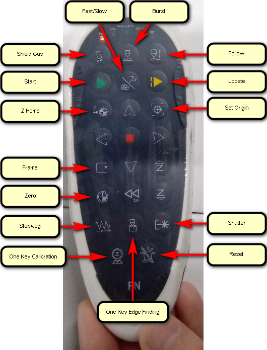

- [Координаты](#координаты)
- [Начало работы](#начало-работы)
- [Создание программы](#создание-программы)
  - [Nest + CoEdge + Отходы](#nest--coedge--отходы)
  - [Доработка готовой детали](#доработка-готовой-детали)
  - [Tips](#tips)
- [Изменение рабочих координат](#изменение-рабочих-координат)
- [Запуск программы](#запуск-программы)
- [Продолжение прерванной программы](#продолжение-прерванной-программы)
- [Ручная обрезка листа](#ручная-обрезка-листа)
- [Окончание работы](#окончание-работы)
- [Обслуживание](#обслуживание)
- [Пробитие](#пробитие)
- [Сгоревший угол](#сгоревший-угол)
- [Разное](#разное)
  - [Освобождение угла](#освобождение-угла)
- [Mitsubishi](#mitsubishi)
  - [Центровка](#центровка)
  - [Направление и качество резки](#направление-и-качество-резки)
- [Документация](#документация)
  - [Protective Lens Disassembly](#protective-lens-disassembly)
  - [Protective Lens Cleaning](#protective-lens-cleaning)
  - [Startup sequence](#startup-sequence)
  - [Shutdown sequence](#shutdown-sequence)
  - [Optical center inspection (recommended parameters)](#optical-center-inspection-recommended-parameters)
  - [Calibrate capacitance](#calibrate-capacitance)
  - [Power curve](#power-curve)
  - [Tips (official doc)](#tips-official-doc)
- [Симулятор на ПК](#симулятор-на-пк)
- [Термины (интернет)](#термины-интернет)
- [Медиа](#медиа)
- [Интернет](#интернет)
  - [Газ](#газ)
  - [Подбор параметров](#подбор-параметров)


# Координаты

**X** - Длинная сторона стола.

**Y** - Короткая сторона стола.

**Z** - Голова.

**W** - Фокус.

**АБСОЛЮТНЫЕ КООРДИНАТЫ** - Абсолютные координаты. Используются при перемещениях головы (например на заранее заданные точки: **Machining(M) -> Mark Point... -> Positioning**). Ноль находится в углу рабочего стола возле монитора.

**РАБОЧИЕ КООРДИНАТЫ** - Относительные координаты. Используются для размещения/вырезания деталей. Ноль находится в текущих координатах головы.

# Начало работы

1. Включить вводной автомат (коробка на стене справа от станка).
2. Проверить уровень жидкости (с тыльной стороны шкафа) в системе жидкостного охлаждения (шкаф с вентилятором на крыше (*Chiller*)). Летом вода, зимой 30% раствор спирта. Будет пищать при недостаточном уровне жидкости.
3. Включить стабилизатор напряжения (большой автомат внутри шкафа, сам шкаф справа от чиллера).
4. Включить станок (сзади станка красная круглая рукоятка).
5. Запустить ПО **BodorThinker3.0**.
6. Вкрутить редуктор, открыть баллон с газом, установить редуктором нужное давление (O2 = 8атм, N2 = 16атм). O2 для стали и нержавейки, N2 для алюминия и нержавейки. Можно открыть сразу оба баллона, станок выберет нужный газ в соответствии с заданным газом в настройках **Layer** . Настройка давления N2 (O2 не настраивать!!!):
    1. Один оператор выставляет 20атм на редукторе.
    2. Второй оператор на станке включает продувку N2.
    3. В этот момент давление N2 упадет и первый оператор подстраивает редуктор на 16атм.
    4. Продувку прекращают (в общей сложности второй оператор продувает 3-4 секунды) и давление само вырастет до 20атм.
    5. В результате давление во время работы будет 16атм, а во время простоя 20атм.
7. Продуть газ перед началом работы  или  (2-3 сек) (для заполнения магистралей или для выдувания неправильного газа из общей магистрали). На концах магистралей с газами стоят эл.магн. клапаны, после них идет одна общая магистраль к голове лазера, в которой либо не будет газа перед началом работы, либо может быть неправильный газ, оставшийся после предыдущей работы станка (забыли стравить газ перед выключением станка).
8. Открыть **Layer**  и импортировать параметры резки для нужного металла (есть фильтры по толщине, материалу).
9. Убедиться, что в голове станка установлен нужный тип сопла (одинарное или двойное), размер сопла (1.0 ... 3.0), открыт нужный вид газа (O2 или N2).
10. Положить лист метала (можно маленький кусочек) для калибровки емкостного датчика высоты.
11.  подать питание на источник лазерного излучения.
12.  открыть заслонку на выходе лазерного источника.
13. Установить голову станка в ноль по **X**,**Y**,**Z** кнопка **Go Home** . Движение в ноль по команде с пульта значительно быстрее.
14. Передвинуть голову на лист (не калибровать на углу листа).
15. Калибровка емкостного датчика высоты **Z** головы над поверхностью:
    1. С пульта, **калибровка одной кнопкой**, быстрее но не видно результатов калибровки на экране (есть настройка авто-отображения результатов после окончания калибровки, но она работает только для кнопки **Calibrate** ).
    2. В ПО:
        1. Нажать иконку **Follow** . Появится окно калибровки.
        2. Опустить голову на поверхность кнопкой **Follow** .
        3. Поднять голову на 5-10мм над поверхностью кнопкой **Z+**  в ПО или на пульте **Z↑**.
        4. Начать калибровку кнопкой **Calibrate** .
        5. По окончании в окне над графиком будут две строки с результатом, должно быть *отлично* или *хорошо* .
        6. **Tips**:
            1. Задать шаг перемещения головы равным 10мм, опустить голову кнопкой **Follow**  и одним нажатием **Z+** поднять голову четко на 10мм. Запустить калибровку.
            2. (НЕ ПРОБОВАТЬ) Либо задать **Follow Height** равным 10мм и опускать голову перед началом калибровки кнопкой **Follow** . Голова должна встать приблизительно на 10мм от листа. Запустить калибровку. Может не сработать, т.к. на высоте 5мм и более график емкости резко идет вверх, в настройках **Follow** задана максимальная высота **Follow Max. H.** равной 5мм.

# Создание программы

1. Начало.
2. Нажать иконку **Nest** .
3. Импортировать детали: DXF или NCEX (может уже содержать список деталей (*Parts*), листов (*Plates*) и готовое размещение (*Nest Result*)).
4. Задать количество деталей, щелкнув на деталь в списке.
5. Прямо в детали (дважды щелкнув ее) задать *перемычки* c *врезкой* (*врезка* нужна для черной стали толщиной 2.5мм и более (информация в разделе *Пробитие* этого гайда)), **M-Joint**  (включить *Micro-joint add leadline*, смотри раздел *Пробитие* этого гайда). Сами *перемычки* нужны только для больших или длинных деталей, чтобы предотвратить поднятие их краев над листом или образования пуза в центре детали.
6. Опционально прямо в детали задать *врезку*, **Lead** . Лучше это сделать сразу для всех деталей за один раз уже после их размещения на листе.
7. Разместить детали на листе (**Nest -> Do nesting...**):
    1. Задать точный (до мм) размер листа (*Plate*) (если лист будет длиннее, при обрезке остатков останется перемычка (не дорежет), если меньше - станок будет резать рабочий стол? или остановится, т.к. датчик высоты покажет, что под головой нет листа).
    2. Задать отступ от края листа (обпил) (*Plate Margin*): 10мм (если меньше, сопло головы может удариться об упоры для листа на рабочем столе!!!).
    3. Задать расстояние между деталями (*Part Space*): 5мм
    4. Задать порядок заполнения листа (*Start Pos*): нижний-правый (ноль станка и упоры справа, возле монитора).
    5. Опционально задать авто-обрезку листа для получения ровных отходов (*Generate Remnant*):
        1. Тип отходов (*Remnant Type*): L-образные, T-образные, прямоугольные.
        2. Отступ от деталей, на котором будет произведен рез (*Cut Distance*) для выравнивания отходов: 3мм. Отступ должен быть равен или больше длины *врезки* (если врезка делается под 90°, иначе длину врезки нужно умножить на синус угла врезки, чтобы получить расстояние начала врезки от кромки детали) в деталь. Иначе, при последующих операциях с деталями, ПО будет ругаться, что линии реза пересекаются и их нужно корректировать (появится окно с соответствующим предложением).
    6. Запустить размещение.
    7. Если детали не влезли на один лист, появится столько листов, сколько нужно.
8. Задать *врезку* сразу для всех деталей (выделить **Ctrl+A**), **Lead** :
    1. *Lead-in -> Type*: Line.
    2. *Lead-in -> Angle*: 90°.
    3. *Lead-in -> Length*: 3мм.
    4. *Seal -> Gap*: 1мм (величина недореза контура). Устанавливать только для наружного контура детали, маленькие отходы внутри детали пусть падают в поддон.
    5. *Advanced Options -> Check Lead-in/out Line* (Данная функция укорачивает *врезки* слишком большой длины, и защищает таким образом от пересечения с другими изображениями). **Lead**  **-> Check The Lead Line** доступ из иконки, в меню **Technics(T) -> Lead Line** этой функции нету.
    6. И прочие параметры по вкусу.
9. Совет: для маленьких деталей можно не ставить *перемычки*, а ограничится одним недорезанным местом основного контура при задании *врезки*, этого достаточно, чтобы деталь держалась за лист.
10. Откорректировать направление врезки (изнутри или снаружи контура), **Unfill/Fill** : *Контурная резка (Fill)* или *Плоттерная резка (Unfill)* определяет направление врезки снаружи (*Fill* внутреннюю "полезную" область) или внутри (*Unfill* внутреннюю "отходную" область) контура детали. Есть автоматический режим.
11. Если после размещения деталей на листе нужно исправить технику реза (врезки, перемычки, фаски, скругления и прочее) в одном типе детали, можно ее выделить, нажать **Edit -> Quantity Modify...** (**Shift + E**), внести изменения и подтвердить их кнопкой **Ok**. Изменения применятся для всех таких же деталей на листе, либо, по желанию, только в выделенной группе. ПО не позволит изменять контура, добавлять или удалять объекты.
12. Визуально проверить правильность направления всех *врезок*.
13. **Clear**  позволяет очистить добавленные элементы в контуре (*врезки* (*Lead Line*), *перемычки* (*Micro Joint*), *компенсацию пропила* (*Kerf Compensation*) и прочее).

## Nest + CoEdge + Отходы

1. Заранее установить желаемые параметры сортировки перед импортом деталей, т.к. по умолчанию она будет применяться при импорте деталей (**Preprocess -> Auto Sorting** ).
2. Импортировать деталь, но не добавлять *перемычки* с врезкой и недорез контура, т.к в процессе *CoEdge* *врезки* удалятся, оставив перемычку, а точка начала контура переместится в нужную позицию для правильного вырезания сопряженных деталей. Можно только дополнительно отсортировать.
3. **Nest** :
    1. **Post-processing -> CoEdge -> CoEdge Params... -> Prevent Collision**: обязательно поставить галочку (**OverCut** можно оставить равным нулю)! Это изменит порядок вырезания наружных контуров деталей так, чтобы предыдущая деталь полностью отделялась только при вырезании следующей детали, тем самым не давая предыдущей детали подыматься над листом. Если галочку не поставить, то сначала полностью вырежется первая деталь, она может подняться и создать угрозу удара для головы при вырезании следующей сопряженной детали.
    2. **Post-processing -> Sort** (опционально еще раз отсортировать).
    3. **Nest Parameters -> Rotate Strategy: -> No Rotation** для однообразия расположения деталей (опционально).
4. Задать *врезку* для всех деталей **Lead**  (**Ctrl + W**):
    1. **Lead-in -> Type: -> Line**
    2. **Lead-in -> Angle: -> 135 deg** (для того, чтобы *врезка* оказалась снаружи детали!)
    3. **Position -> Automatic Lead Position -> Edge First** (именно *Edge*, не *Corner*, это переместит *врезку* для последней детали на *Edge*, иначе врезка останется в *Corner* и встанет поверх уже разрезанного контура) [Хотя... можно не делать, т.к. в следующем пункте мы все равно автоматически переместим *врезку* в *перемычку*]
5. Задать *перемычку* с *врезкой* **M-Joint**  (**Shift + X**) в последней (самой левой) детали сверху и снизу для того, чтобы она не подымалась, когда будем выравнивать (отрезать) отходы:
    1. **Auto Modify the Start Pos to Micro Joint** (переносим *врезку* в *перемычку*)
    2. **Micro-joint add leadline -> type(T): Line**
    3. **Micro-joint add leadline -> angle(A): 90 deg**
6. Нарисовать линии для отрезания ровного отхода:
    1. Первую линию рисуем возле точки начала/окончания контура последней (самой левой) детали, от угла детали вертикально к краю листа (это задает направление реза!, если вдруг перемычка оторвется, то голова опустится сверху на поднятую деталь и возможно сработает защита).
    2. Вторую линию рисуем с другой стороны детали, от угла детали вертикально к другому краю листа. Такой порядок также задает порядок сортировки и минимизирует перемещения головы.
    3. После рисования любых объектов, при запуске на выполнение программы резки, ПО покажет предупреждение и предложит отсортировать графику перед запуском, не соглашаться, иначе линии реза отходов могут быть отрезаны первыми. Это предупреждение отключается в настройках: **System Parameters -> 4.0.0 General -> Tips for reordering before work -> No**.
7. Проверить сортировку и вперед, резать.


## Доработка готовой детали

1. Вариант 1.
    1. Нарисовать габарит детали и отключить его вырезание. Это нужно для того, чтобы ноль графики не притягивался к *рабочему* нулю при автоматическом **Set Origin** при запуске программы на выполнение.
    2. Добавить графику, которую нужно вырезать.
2. Вариант 2.
    1. **System Parameters -> 4.0.1 Clear Workcoor -> Auto clear workcoor in nimble mode -> No** отключаем автоматическое **Set Origin** при запуске программы вырезания деталей.
    2. Добавить графику на нужных координатах относительно нуля *рабочих* координат.

## Tips

1. Выделение мышкой слева-на-право выделит только то, что полностью попало в рамку выделения. Выделение мышкой справа-на-лево выделит все контура, которые полностью или частично попали в рамку выделения.
2. **Ctrl** + выделение = добавить к текущему выделению. **Shift** + выделение = убрать из текущего выделения.
3. Зажать **Ctrl** чтобы повернуть деталь, **Shift** чтобы потянуть за один край детали, **Alt** чтобы растянуть или сжать деталь симметрично относительно центра детали.
4. При ручном перемещении деталей, грань одной детали может *прилипать* к грани другой детали и не выходить за ее габарит. Для удобства ручного размещения деталей.
5. Автоматически задать разное направление реза (*CCW* for *Fill* and *CW* for *Unfill*) для выделенных деталей можно только в **One-Click Setting** . В **Reverse**  этого сделать нельзя, действие не применяется к выделенным деталям!
6. В **One-Click Setting**  не работает должным образом **Lead-in/out Line -> Auto Set Position**, всегда помещает в угол линию врезки, даже если указать этого не делать. В общем **One-Click Setting** использовать только для задания направления реза.
7. **Nest -> One Key Nesting...** позволяет разместить детали разных видов, (находящиеся в *Draft*), на листе заданного размера.
8. **Nest -> Bestre Nesting...** позволяет замостить лист заданного размера деталью одного вида (находящейся в *Draft*). Функция поломана: после ее выполнения должны отобразиться заготовка и расположенные детали, по факту появляются только детали, нужно дорисовать заготовку и как-то привязывать детали к заготовке.
9. Дополнительные иконки с настройками, которые больше нигде не появляются (sic!):
    1. Создать *Nest*.
    2. Импортировать деталь.
    3. Дважды на ней щелкнуть для редактирования.
    4. Выделить контур.
    5. Вверху появятся новые кнопки настроек. Что за бред!
10. **Edge Finding**:
    1. *Thin Plate (Within 10mm)*: is 6-point edge finder, recommended to use on thin plate. Laser head will execute 6 times find edge actions to reduce the interference of machine teeth. (При поиске граней на тонком листе зубья на рабочем столе определяются как край листа и вносят погрешность. Лист нужно положить так, чтобы передний край оказался в промежутке между ламелями, чтобы они не вносили погрешность.)
    2. *Rack Clearance*: расстояние между вершинами зубьев на ламели? 35мм. (Rack это точно зуб).
    3. *Back Distance*: расстояние между ламелями? 60мм.
11. **Bridge**  позволяет соединить части детали, которые нежелательно разделять после резки (например буквы). Кроме того, данная функция помогает уменьшить количество *пробитий* и *врезок*, если соединить наружные кромки всех однотипных деталей в одном ряду или столбце и вырезать их за одно включение лазера.

    

12. Порядок обработки узких длинных деталей должен выполняться справа налево (от края листа к его центру), иначе лист начнет вибрировать или отклоняться из-за недостаточной поддержки.

    

13. **System Parameters -> 4.0.0 General -> Automatically switch to the calibration data interface during calibration -> Yes** относится только к кнопке , и не работает для **One Key Calibrate** при запуске с пульта :(.
14. После нажатия горячей клавиши для выбора инструмента (отсечение линии, сегментация линии, прочее...) курсор мыши не изменяется, нужно передвинуть курсор и тогда он поменяется на изображение инструмента, просто пиздец.
15. **Datum Copy (Ctrl + Shift + C)** позволяет задать базовую точку при копировании и объекта. Эта же точка будет использоваться для вставки объекта.
16. **Sort -> Advanced Options -> Divide Grid**:
    1. **AutoSet**: to automatically divide objects into the same group based on the distance and count.
    2. **Fixed Value**: the objects whose distance is less than the set value will be divided into the same group.

    Sort *First Bottom*, *Divide Grid* Disabled.

    

    Sort *First Bottom*, *Divide Grid -> Fixed Value* Enabled.

    

# Изменение рабочих координат

1. **Set Origin**  - установить ноль *рабочих* координат. Ноль размещенных деталей переместится в ноль *рабочих* координат (абсолютные [текущие] координаты головы). После нажатия этой кнопки и перемещения деталей на экране, изображение деталей на экране будет отображать то, что произойдет, если запустить программу на выполнение.
2. **Zero**  - переместить голову в ноль *рабочих* координат.

Фактически, если переместить голову в другое место и запустить программу на выполнение, то вначале будет автоматически выполнена команда **Set Origin**, а уже после начнется резка деталей.

# Запуск программы

**ИЗОБРАЖЕНИЕ НА ЭКРАНЕ ОБМАНЧИВО!!!**

**ТЕКУЩИЕ КООРДИНАТЫ ГОЛОВЫ ВСЕГДА ЯВЛЯЮТСЯ НАЧАЛЬНЫМИ КООРДИНАТАМИ ДЛЯ ПРОГРАММЫ РЕЗКИ!!!**

**НАПРИМЕР ДЕТАЛЬ ПОКАЗАНА В НАЧАЛЕ КООРДИНАТ РАБОЧЕГО СТОЛА, НО ФАКТИЧЕСКИ ОНА БУДЕТ ВЫРЕЗАТЬСЯ С ТЕКУЩИХ (АБСОЛЮТНЫХ) КООРДИНАТ ГОЛОВЫ!!!**

1. Отодвинуть голову и положить лист метала.
2. Установить координаты головы:
    1. В начало координат, кнопка **Go Home** .
    2. В произвольное место на листе метала, где хотим начать вырезать детали.
3. Кнопка **Frame**  заставит голову станка описать в воздухе необходимые габариты листа (и его положение), которые нужны для выполнения текущей программы, лазер не включается, голова не опускается (визуальная проверка габаритов).
4. Кнопка **Trace**  запустит передвижение головы по программе без включения лазера, голова не опускается. (визуальная проверка очередности реза).
5. Кнопка **Simu**  запустит симуляцию программы в ПО, голова не двигается, лазер не включается.
6. Кнопка **Start** **▶** запустит программу резки.
7. После окончания, можно вручную разрезать металл на остатки кнопкой **Cut Sheet** .
8. Кнопка **Select**  позволяет резать только выделенные контуры. Если кнопка нажата, но не выделен ни один контур, появится ошибка при попытке запуска программы.

# Продолжение прерванной программы

1. Станок остановили: кнопкой , *грибком* (аварийная остановка), по нажатию клавиши **F2**, пропала электроэнергия.
2. Голову сдвинули в произвольное место для устранения проблемы.
3.  вернет голову в место остановки, голова переместится по траектории назад на 2мм (по умолчанию). Станок остановлен.
4.  вернет голову в место остановки, голова переместится по траектории назад на 2мм (по умолчанию). Станок продолжает резать лист по программе.
5. Кнопки **⏪** и **Fn+⏪** (активирует **⏩**) перемещают голову станка по контуру реза (перемотка программы вперед и назад). Перемотав программу, можно возобновить работу кнопкой  (дорезав неразрезанную деталь или пропустив ненужную деталь).
6. Кнопка  всегда начинает выполнять программу с самого начала с текущей позиции головы.
7. Tips.
    1. Функция **Resume** все еще действует после изменения настроек реза в **Layer** или изменения системных настроек.
    2. ПО каждые 5 секунд сохраняет состояние выполнения программы. В худшем случае, после пропажи питания, ПО может вернуть голову лазера назад по программе на 5 секунд.

# Ручная обрезка листа


Если *рабочие* координаты установлены не в начале рабочего стола, то появляются отрицательные *рабочие* координаты. Тогда становится понятным описание направления реза.

*Cut Direct*: X:negative to positive - первый рез пойдет от нуля в негативную сторону, второй рез пойдет от нуля в позитивную сторону. Ноль это текущее положение головы!

Источник: **lc80ef-operation-manual.pdf**


# Окончание работы

1. Закрыть баллоны с газом, выкрутить редукторы (вывести пружину из работы).
2. Продуть газы O2 и N2 в станке, сняв остаточное давление в магистралях.
3. Заклеить сопло скотчем.
4. Выключить ПК.
5. Выключить станок.
6. Выключить стабилизатор напряжения.
7. Выключить вводной автомат.

# Обслуживание

1. Фокусные и коллиматорные линзы заменяются сервисным центром.
2. Чистка защитного стекла: извлекаем стекло из оправы, ватной палочкой (идет в комплекте со станком) и жидкостью для протирки оптики чистим стекло, протираем специальной шелковой тряпочкой без ворсы. Устанавливаем стекло в оправу (вставляется туго), сжатым воздухом из баллончика сдуваем пылинки со стекла перед непосредственной установкой оправы в голову.
3. Центровка луча лазера (на сопле диаметром 3мм для лучшей визуализации) производится только одним человеком:
    1. Наклеить скотч на сопло.
    2. Нажать кратковременно кнопку **Laser**  (эта кнопка вручную включает лазер!!!).
    3. Лазер сделает отверстие в скотче. Снимаем скотч и смотрим на след от сопла, отверстие по центру сопла или нет.
    4. Юстируем луч по X и Y шестигранником (идет в комплекте со станком) на голове (возле рисунка с направлением координат **X** и **Y**).
4. Керамическое кольцо используется как тепловой изолятор для предотвращения передачи тепла от очень горячего сопла к голове. Сквозь кольцо проходит проволочка к металлическому соплу (оно является частью емкостного датчика высоты).

# Пробитие

Materials: Carbon Steel (Cs) Черный метал, Stainless Steel (Ss) Нержавейка, Aluminum (Al) Алюминий, Brass (Br) Латунь. В файле конфигурации наверно ошибка, указано Ai, а не Al для алюминия. При сохранении настроек **Layer** можно создать свой материал. Наверно кто-то неправильно ввел сокращение для алюминия.

*Пробитие* метала (*Piercing* в ПО, *Punch* в файлах настроек **Layer**) перед началом реза. Лазер прожигает отверстие (оставляя каверну) и только после этого начинает движение (на кромке детали останется половина оплывшего отверстия). Чтобы избежать *пробития* на контуре детали, задают *врезку*: лазер включается в стороне от детали, *пробивает* метал и начинает рез в направлении контура детали, далее по контуру детали. Тоже самое и для *перемычек* с *врезкой*. Оплывшее отверстие остается в отходах.

**None Piercing**: Cs 1.2 1.5 2, Ss 1.5 2+N2

**1 Seg. Piercing**: Al 2 2.5 3, Cs 2.5 3 4 6, Ss 2+O2 3

**2 Seg. Piercing**: Cs 8.

**3 Seg. Piercing**: Cs 10.

# Сгоревший угол

Угол детали (от 0 до 90 градусов) может сгореть при резе из-за накопления тепла. Варианты решения:

1. **Layer**: включить и настроить график изменения мощности/частоты лазера в зависимости от скорости головы (голова замедляется на поворотах).
2. **Cool Point** : точка охлаждения в углу.
3. **Ring Cut**: сделать петлю снаружи угла, чтобы дать время остыть материалу.
4. **Chamfer -> Create Chamfer by Fill or Unfill** : скруглить угол только для наружного контура, внутренний контур (отход) пусть горит. Настройка применяется только один раз! Она меняет графику. Если нужно изменить радиус скругления, то нужно отменить действе команды путем **Undo** или **Ctrl + Z**, сделать это посредством **Clear**  не получится.
5. Использовать настройку **SharpCorner** не отображаемую в **Layer**, но присутствующую в самом файле настроек реза.

# Разное

1. Для кислорода устанавливается положительный фокус лазера и отрицательный для азота.
2. В станке нету защитного газа (соответствующие кнопки в ПО и на пульте ничего не делают).
3. *Chiller* оставлять постоянно включенным (охлаждает оптоволоконный лазерный источник внутри станка и голову станка).
4. *ПО* - под этой аббревиатурой скрывается встроенная оболочка **BodorThinker3.0** для работы со станком.
5. Для резки метала с защитной пленкой (часто нержавейка идет с пленкой) или для резки метала со слоем ржавчины есть специальная настройка в **Layer**: **Film Cut**. Лазер делает предварительный тонкий рез поверхности (пленки или слоя ржавчины) и вторым проходом делает рабочий рез на всю глубину. Настройки для **Film Cut** находятся в последнем слое: **Layer -> Global Params -> Film Cutting Process**.
6. Вся работа с деталями выполняется только после выделения контура (**Ctrl+A** или мышкой).
7. Чтобы деталь не выпадала, можно задать, чтобы лазер не дорезал контур до самого конца (задается при добавлении *врезки*). Годится для маленьких деталей, но не годится для больших, т.к противоположная сторона длинной детали остается не закрепленной и будет подыматься, опускаться или появится пузо в центре детали. Поэтому добавляют *перемычки*. Без *перемычек* лист метала может начать прыгать при резке, появится куча искр, оплывы с изнаночной стороны, лазер заедет в деталь лучом и прочее. Некоторые в этот момент придерживают лист рукой (с нарушением ТБ), чтобы он не скакал во время резки.
8. На пульте кнопка **Улитка\Олень** задает скорость ручного перемещения (стрелки на пульте) головы станка. Можно удерживать кнопку и нажимать стрелки для временного включения режима.
9. На пульте кнопка **Пила и две стрелки вправо под пилой** включает\выключает пошаговое ручное перемещение (стрелки на пульте) головы станка.  Можно удерживать кнопку и нажимать стрелки для временного включения режима.
10. При первом перемещении головы после включения станка по X или Y может произойти рассинхронизация энкодеров. Станок начнет вибрировать и издавать характерные звуки заклинивания направляющих, как будто направляющая заедает то с одной стороны, то с другой. В этом случае остановить перемещение. Полностью выключить станок (электрическую часть) и включить снова. Перемещение должно стать нормальным.
11. Вместо кислорода можно применять обычный воздух, винтовой компрессор отечественного производства на 15атм стоит 6500$.
12.  with it checked, the laser will keep on during manually moving the axis for
a certain distance. After jog cutting ends, the checking status will be canceled by default, and the laser will not be automatically turned on during the next machining.
13.  вручную включить вентилятор вытяжки (в настройках задано автоматическое включение при начале резки).
14.  блокирует ПО, пароль **123456**.
15. Имея DXF файл можно заранее открыть его в ПО на ПК и добавить *врезку*, *перемычки* с *врезками* и прочее что нужно. Сохранить в NCEX и открывать уже готовую деталь на станке, удобнее и быстрее.
16. **BodorThinker3.0** это ребрендинг оригинального **NcEditor** от **Weihong**.
17.   для профессиональных моделей станков (model P), в которых есть два подвижных стола, один над другим. Нажатие на кнопку указывает, какой стол будет рабочим (один стол уезжает в заднюю часть станка, а другой приезжает в переднюю часть станка под голову лазера).
18. Перед применением **Kerf Compensation** текст должен быть преобразован в графику (**Optimize -> Convert Text to Graphic**).
19. При обработке металла, содержащего цинк (покрытие или латунь), могут выделяться пары цинка!
20. Настройки пробития можно почитать в **NcEditor-v12-User-Manual.pdf** (раздел 2.2.1.2).
21. Подробное описание калибровки и слежения за высотой головы можно почитать в **NcEditor-v12-User-Manual.pdf** (раздел 2.3).
22. Подробное описание процесса **Go Home** можно почитать в **NcEditor-v12-User-Manual.pdf** (раздел 3.4.3).
23. Подробное описание коррекции ошибок позиционирования можно почитать в **NcEditor-v12-User-Manual.pdf** (раздел 3.6).
24. **Mitsubishi-Fiber-Optic-Laser-Cutting-Guide-Ru.pdf & Mitsubishi-CO2-Laser-Cutting-Guide-Ru.pdf** описание некачественной кромки с картинками и советами по решению проблемы.
25. **Abamet-AML3015-Инструкция-Оператора-2020-v1.4.pdf** хорошее описание обслуживания головы, технологии лазерной резки, метод проверки защитного стекла черной фотобумагой, влияние параметров на качество реза.
26. Прежде чем что-то менять в настройках нужно проверить защитное стекло и сопло на предмет загрязнения и повреждения, проверить центровку.
27. При резке рядом с кромкой материала, где меняется электростатическая емкость последнего, высока вероятность контакта между кончиком сопла и заготовкой. Убедитесь в том, что расстояние между вырезаемой деталью и краем листа составляет не менее толщины последнего.
28. Так же, как и на кромке материала, электростатическая емкость меняется, если зазор между деталями мал. Рекомендуется, чтобы зазор между деталями составлял не менее толщины листа (в зависимости от формы детали из этого правила могут быть сделаны исключения).
29. После каждой смены сопла и настройки фокусного расстояния необходимо производить центрирование сопла относительно фокусирующей линзы. В противном случае возможно повреждение сопла и/или режущей головы.
30. Волоконный лазерный источник предназначен исключительно для обработки металлов. Другие материалы, такие как, фанера, акрил, и т.д., обрабатываемые на газовом лазере (10.6 мкм), не поддаются обработке волоконным лазером из-за низкого коэффициента поглощения этими материалами длины волны, генерируемой волоконным источником (1,07 мкм).
31. **CW** (Continuous Wave) непрерывный режим лазера, **QCW** (Quasi Continuous Wave) импульсный режим лазера.
32. В настройках реза **Layer**  не отображается настройка для острых углов, которая присутствует в самом файле настроек (попробовать использовать для решения проблемы сгоревших углов):

    ```json
    SharpCorner = {
        SharpCornerAngle = 60,
        DutyCycle = 10,
        Frequency = 10,
        Enabled = false,
        SharpCornerLength = 5,
        PeakPower = 100,
    },
    ```

33. **Sort -> Identify Inner/Outer Contour** позволяет автоматически определить и задать **Fill/Unfill** для всех контуров во время сортировки (по сути автоматически выполняет для всех контуров команду **Unfill/Fill -> Auto Set**), это удобно при ручном рисовании, избавляя от лишней операции. Но, если мы пытаемся доработать готовую деталь, например дверь, нужно дополнительно включать еще одну опцию, чтобы правильно определить и задать **Fill/Unfill** свойство для контуров. Мы имеем наружный контур, показывающий габарит двери. Этот контур отключен, чтобы лазер его не вырезал. Отключенный контур не имеет свойств **Fill/Unfill** и не учитывается при автоматическом определении **Fill/Unfill** свойств, поэтому ПО будет автоматически определять контура лампочек, отверстий, проемов как **Fill** и будет выставлять *врезку* снаружи контура, что неправильно в данном случае! Это исправляется дополнительной опцией **Sort -> The Outmost is Inner Contour**, которая временно задает свойство **Fill** наружному отключенному контуру габарита двери и соответственно **Unfill** для всех внутренних контуров, выставляя *врезку* изнутри контура.
34. **Common Parameters -> Leap Frog**. When there is no frog leaping function, the cutting process of a cutter is divided into three parts: after finishing cutting a curve, the machine moves up perpendicularly in the Z axis, then moves the cutting head to the next cut point horizontally, and then lowers the cutting head for the next cutting. However, with the help of frog leaping, the cutting head will move up while moving horizontally until reaching the height set by Z-up delay time, and then move down to the cut point in a curve within the follow-up delay, so the whole process is completed in a curve, which saves G00 time and improves cutting efficiency.
35. **BodorThinker3.0\Bin\NcEditor\res\UserManualRes_ENG.chm -> 7.5. List of System Parameters**.
36. Центровка на акриловой пластине: **ml2512ex-f_ml3015ex-f_service-manual.pdf** (раздел 5.3).
37. Чистка защитного стекла: **ml3015sr-f20_service-manual.pdf** (раздел 4.1).

## Освобождение угла

**Technics -> Release Angle** используется при гибке деталей.



# Mitsubishi

## Центровка


## Направление и качество резки

Круговая поляризация лазерного луча иногда приводит к разнице в качестве поверхностей материала
по обеим сторонам реза. Для создания программы резки, которая обеспечивает более высокое
качество поверхностей на кромках изделия, рекомендуется воспользоваться следующими советами.


*Поверхности реза могут не отличаться по параметрам шероховатости или налипания окалины.

# Документация

Длина волны излучения: 1070 нм. (Сайт лазерного источника).
Laser wavelength is 1.064um. (Документация со станком).

We do not recommend cutting high-reflective materials for a long time because they can easily cause fire and damage to the laser and fiber.

At the time of cutting highly reflective materials such as copper and aluminum, we do not recommend long-term cutting.

If an operator looks at the processing position for a long time, visible rays may cause damage to the operator. Especially, plasma produced in the high-speed cutting process or manufacturing of galvanized steel plate, titanium, aluminum and high-quality steel, produces bright light, may cause permanent damage to the retina.

The A series products are the equipment for cutting metal materials with a laser. The A series products shall not be used for cutting non-metals (e.g. glass, acrylic materials, wood, etc.)!

Compressed air: which is required to be clean, water-free, oil-free and free from other impurities, and used for thin carbon steel, thin stainless steel, etc. where conditions permit.

The oxygen is mainly used for cutting plain carbon steel, and the nitrogen for cutting non-ferrous metals, e.g. stainless steel and alloy steel.

The centralized lubrication system automatically oils to the sliding blocks.

We recommend completely replacing water in the water-cooling machine every two to three months.

There will be two air tubes led from the lathe bed, one of which is used for connecting nitrogen (which is also used by compressed air), and the other pipe is used for connecting oxygen.

The temperature of the gas used shall not exceed 50℃.

Do not turn on the fiber optic device before the water temperature rises to 20℃ if the water temperature is low.

Before processing, you need to make sure that the workpiece graphics can safely run within the plate. Measures should be taken to prevent the laser cutting head from descending and impacting outside the plate to block the blade after starting to cut, thereby damaging the laser cutting head.

To execute breakpoint resume when the power interruption or E-stop occurs and the workpiece origin is secured, press . Note: Before executing breakpoint resume, please make sure the machine coordinate is correct. Otherwise, please execute returning to the machine origin first (**Go Home**).

Remote key combination  + any arrow key or  + any arrow key temporary enable **Rapid** or **Step** mode.

**Note. When changing the nozzle or adjusting the center of the beam manually, the laser shutter  should be closed manually to ensure the safety of the operator.**

When the nozzle or sensor touches the machine or plate, the laser head will feed back the collision electronic signal to the system thanks to the use of the distance sensing system, thereby stopping the action.

The cutting gas also has the function of cooling the protective window.

When the focusing protective window adheres to impurities or foreign objects, the protective window will be damaged due to the absorption of the laser heat by the impurities or foreign objects. Therefore, the protective window needs to be cleaned regularly. It is recommended to clean once a week.

## Protective Lens Disassembly

1. Open the end cover of the protective lens, pinch both sides of the drawer-type lens holder and pull out the protective lens holder.
2. Loosen the top wire on the end face of the lens holder, remove the protective lens pressure ring, and take out the lens with the finger cot.
3. Clean the lens, lens holder, pan plug seal and vinyl pad.
4. Install the clean new lens (regardless of front and back) into the drawer type lens holder.
5. Reinstall the protective lens press ring.
6. Re-insert the protective lens holder back into the laser head, pay attention to the installation direction, pan plug seal is below and lock the end cover.

**Note: Do not pull out the edge of the plug seal directly. This will damage the plug seal and affect the seal. The focusing protective lens plug seal is a vulnerable part, and the replacement cycle is every three months!**


## Protective Lens Cleaning

1. Wear finger cots on the left thumb and index finger.
2. Spray isoethanol on the absorbent cotton swab.
3. With the lens facing both eyes, hold the absorbent cotton swab in your right hand, gently wipe the lens from bottom to top or from left to right in a single direction (do not wipe back and forth to avoid secondary contamination of the lens).
4. Blow the surface of the lens with a rubber blowing balloon. Both sides should be cleaned.
5. After cleaning, confirm that there are no residues of the following: detergent, absorbent cotton, and foreign matter.

## Startup sequence

1. Host and operational software.
2. Air feeder.
3. Water cooler.
4. Fiber optic device.

We recommend conducting a calibration operation every time after starting up or replacing the metal plates.

We do not have any strict requirement for the startup sequence of each component.

## Shutdown sequence

1. After the processing is completed, please click **N2** or **Air**/**O2** to release the gas in each gas tube and close the gas supply device.
2. You need to stick the tape under the nozzle of the cutting head to prevent the dust in the air from entering the cutting head.
3. Move the X Axis and Y Axis to the middle of the machine tool to prevent the transmission shaft from deforming as a result of its own gravity, thereby affecting the cutting accuracy.
4. After turning off the laser output of the laser, you need to disconnect the power supply.
5. You need to disconnect the power supply after turning off the switch on the water cooler.
6. Close out of the control software and power off the host of computer.
7. To prevent fire and eliminate potential safety hazards, please check the surrounding environment of the machine tool to see whether there are fire or high temperature objects.

## Optical center inspection (recommended parameters)

1. Appropriate power (80-100W).
2. Nozzle with a diameter of 1.0
3. Focus shall be between -1 to 1.
4. In this way, small light points are easy to be observed.

## Calibrate capacitance

1. Move the cutting head to the position about 5mm far from the workpiece surface, and keep the workpiece still all the time.
    1. If you have never calibrated capacitance, click Z axis direction button to change height.
    2. Click **Calibrate**.
2. If you have calibrated capacitance before, click **One Key Calibrate**.

It is recommended that the actual cutting height is between 0.5 and 1.5mm. If the actual cutting height is not accurate, the calibration shall be carried out.

## Power curve

Used to make the cutting power and frequency change with the cutting speed accordingly and make sure thermal power absorbed in unit area is the same and achieve fine cutting result, so as to solve problems like over-burning around the corner and different cutting results in terms of thickness. Open **Layer** settings, find **Cutting Power Curve** area. To adjust speed power and speed frequency, check **Adjust Speed Power** and **Adjust Speed Frequency** in **Power Curve** area. The system makes the cutting power and cutting frequency change with the cutting speed during cutting. Otherwise, the cutting power and cutting frequency keep the same all the time during cutting.

The operating environment is 10℃ ~ 35℃.

## Tips (official doc)

1. We recommend that the layout spacing is ≥0.8 time the thickness of the plate to avoid thermal deformation and poor cutting.
2. The intensive cutting within a small range of this processing method will cause damage to the lathe bed (рама станка) and the countertop (игольчатый настил на раме), which is not covered by the product warranty.
3. In the event of long-stroke continuous cutting (single cutting straight line > 2m), thermal deformation of the plate will affect the final straightness, which is not covered by the product warranty.

# Симулятор на ПК

Не нажимать на кнопку **Go Home**  в программе на ПК. Симулятор будет пытаться загнать голову в бесконечность!!! После этого кнопка **Zero** также начинает двигать голову в бесконечность.

# Термины (интернет)

**Kerf** - ширина реза.

**FlyCut** - для быстрой резки круглых и прямоугольных отверстий. Это режим выбора стратегии резки прямоугольных и круглых отверстий, который позволяет двигаться рабочей голове непрерывно по кратчайшей траектории. Актуален только для тонких материалов до 1 мм.

**CoEdge** - убирает повторяющиеся линии, чтобы не резать два раза по одной и той же линии.

**Edge Seek** - определение положения листа на столе.

**Поддержка автофокуса** - это функция лазерной головы, нужна, чтобы прорезать толстый материал и опускаться вместе с ним, альтернатива пробивки.

**3-Stage Pierce** - трёх-этапная пробивка, для больших толщин.

**Pre-Pierce** - предварительная пробивка точек. Станок сначала проезжает и пробивает отверстия в нужных точках, это ускоряет работу при резке толстых материалов и позволяет добиться лучшего качества реза, чаще применяется на мощных лазерных станках.

**Ring Cut** - инструмент для расстановки специальных петель для предотвращения перегрева при резке острых углов на толстых металлах.


# Медиа

Пульт:



Одинарное сопло (используется при резке тонколистовой стали, а также других металлов всех толщин):


Двойное сопло (используется при резке толстолистовой черной стали):


Повреждение сопла:


Чиллер:


Оптоволоконный лазерный источник Maxphotonics:


ПO для настройки лазерного источника (для работы станка не нужно, можно закрывать при запуске ПК):


Устройство головы:


Положение фокуса:


Пробитие (прокол):


Рама (портал) и рабочий стол:


| Material | Thickness | Speed | Height | Focus | Diameter | Type  |  Gas  | Pressure | Piercing |
| :------: | :-------: | ----: | :----: | ----: | :------: | :---: | :---: | :------: | :------: |
|          |    mm     | m/min |   mm   |    mm |    mm    |       |       |   bar    |          |
|    Al    |    2.0    |  9000 |  0.5   |  -1.5 |   3.0    |   S   |  N2   |   2.8    |    1     |
|    Al    |    2.5    |  5500 |  0.5   |  -1.5 |   3.0    |   S   |  N2   |   2.8    |    1     |
|    Al    |    3.0    |  4000 |  0.5   |  -2.0 |   3.0    |   S   |  N2   |   2.8    |    1     |
|    Cs    |    1.2    |  5300 |  0.8   |   2.0 |   1.5    |   D   |  O2   |   3.0    |    0     |
|    Cs    |    1.5    |  4200 |  0.8   |  1.75 |   1.5    |   D   |  O2   |   2.8    |    0     |
|    Cs    |    2.0    |  3300 |  0.8   |   2.5 |   1.5    |   D   |  O2   |   2.5    |    0     |
|    Cs    |    2.5    |  2600 |  0.6   |   3.3 |   1.5    |   D   |  O2   |   0.7    |    1     |
|    Cs    |    3.0    |  2200 |  0.6   |   3.3 |   1.5    |   D   |  O2   |   0.7    |    1     |
|    Cs    |    4.0    |  2000 |  0.6   |   3.3 |   1.5    |   D   |  O2   |   0.7    |    1     |
|    Cs    |    6.0    |  1300 |  0.6   |   3.7 |   2.0    |   D   |  O2   |   0.6    |    1     |
|    Cs    |    8.0    |   900 |  0.6   |   3.7 |   2.0    |   D   |  O2   |   0.6    |    2     |
|    Cs    |   10.0    |   650 |  0.6   |   3.7 |   2.5    |   D   |  O2   |   0.55   |    3     |
|    Ss    |    1.5    | 14000 |  0.5   |  -1.5 |   3.0    |   S   |  N2   |   2.8    |    0     | error! |
|    Ss    |    1.5    | 12000 |  0.5   |  -1.5 |   3.0    |   S   |  N2   |   2.8    |    0     | error! |
|    Ss    |    2.0    |  3300 |  0.8   |   2.2 |   1.5    |   D   |  O2   |   6.0    |    1     |
|    Ss    |    2.0    | 12000 |  0.5   |  -1.5 |   3.0    |   S   |  N2   |   2.8    |    0     |
|    Ss    |    3.0    |  2300 |  0.8   |   2.2 |   1.5    |   D   |  O2   |   6.0    |    1     |
|    Ss    |    3.0    |  4000 |  0.5   |  -2.0 |   3.0    |   S   |  N2   |   2.8    |    1     |

Ss 1.5mm неправильные параметры, файл имеет имя O2, но все параметры для N2. Женя неправильно сохранил?

# Интернет

## Газ

**Кислород**. Кислородом НЕЛЬЗЯ резать нержавейку. Если мы будем ее резать кислородом, то материал по сути будет гореть, ведь горение - это ни что иное, как окисление при высокой температуре, а кислород - катализатор горения. Таким образом из нержавейки мы делаем ржавейку, окисляем её, то есть попросту убираем все её нержавеющие свойства.

**Азот**. Предохраняет металл от окисления, охлаждает его и удаляет продукты горения из зоны реза. Чернуху можно резать и азотом, но это будет слишком дорого и невыгодно, а так как она не имеет нержавеющих свойств, то нет смысла и сохранять их. Если нужно сохранить свойств металла (кроме чернухи) - используют азот.

**Аргон**. Для резки титана нужен аргон. Титан при лазерной резке вступает с азотом в реакцию, крошится, теряет свою структуру и свойства.

Когда мы режем материал, его необходимо сначала пробить. В момент этого пробоя давление кислорода должно быть 0,15-0,2 МПа, а в процессе резки – достаточно 0,5-0,6 МПа и станок должен регулировать это расхождение в давлении.

Если кислородом пробивать материал с таким же давлением, с каким режешь, то полетят брызги расплавленного металла, т.к. кислород, как мы выяснили выше – катализатор горения. С азотом таких заморочек нет, можно поставить условные 2 МПа и пробивать и резать на одном и том же давлении.

Для резки азотом нормальное давление - 1,6-1,8 МПа, а с кислородом - 0,5-0,6 МПа, т.е. расход газа практически в три раза меньше.

Однако, несмотря на то, что кислородная резка дешёвая - она сложная и требует опыта в настройке параметров.

Чуть-чуть отклонение по давлению, не тот диаметр сопла - и у тебя будет плохой рез.

**Воздух**. Для нормальной резки воздухом нужно давление 1,6-1,8 МПа, но чтобы после всех осушителей и систем фильтрации добиться такого давления на выходе, до фильтров должно быть 20-25 атмосфер. А такой компрессор уже стоит нормальных денег. Поэтому стоимость компрессора с хорошей системой осушителей будет стоить достаточно дорого.

Воздух актуален только если вы режете не больше 1,5 мм и если не гонитесь за цветом кромки.

Если вы режете нержавейку воздухом, то торец будет не белый, а будет слегка желтить, так как воздух содержит 8-10 процентов кислорода.

Воздух – это не бесплатно. Это сложно и дорого. Чтобы вся эта система нормально работала, в неё стоит хорошо вложиться. Если вы режете то чернуху, то нержавейку, то одно, то другое - то лучше работайте на газах.

**Газификатор** - это большой баллон, в котором газ содержится в жидкой форме. Именно поэтому газ из газификатора очень чистый. К тому же он экономичней.

## Подбор параметров

Действия по поиску правильного положения фокуса не должны занимать много времени. Для этого просто следуйте нескольким простым алгоритмам:

1. Уведите линзу в крайнее положение.
2. Выберите шаг перефокусировки. Шаг не должен быть слишком большим, так как можно пропустить оптимум, но и не слишком маленьким, чтобы не тратить время на поиск. Предположим, при перемещении из одного крайнего положения в другое вы пройдете через 12 положений линзы.
3. Вырежьте 12 тестовых деталей. Оптимальная форма - небольшой квадрат. Можно также делать просто прямые резы на листе. Пронумеруйте детали или прямые линии и подпишите рядом положение фокуса на квадрате или рядом с линией.
4. Осмотрите рез со стороны падения лазерного пучка и снизу и выберите режим с наилучшим видом линии или кромки. То есть с минимальной зоной термического влияния, без капель и грата. В дальнейшем вы всегда сможете вернуться к этой пробной резке и восстановить оптимальную фокусировку, уже не проводя детальной проверки.

Если все же вы видите, что качество резки улучшилось, но пока не оптимальное, зафиксируйте найденное положение фокуса линзы и проведите подобные процедуры с каждым из параметров по отдельности: расстояние от сопла до листа, давление газа, скорость резки, мощность лазера. Каждый раз, меняя рабочий параметр, следуйте тому же самому принципу - двигайтесь всегда от одного крайнего значения параметра к другому с шагом одного знака. Так вы не потеряетесь в огромном количестве параметров, которые вы оптимизируете для вашего конкретного процесса.

Стоит также помнить, что найденный набор технологических параметров не останется одним и тем же раз и навсегда. Если в силу какой-то причины хоть один изменится, придется пересматривать и остальные.

Положение фокуса может меняться как при смене материала, так и при смене газа. Об этом факте стоит помнить, например, при переходе на кислород иной чистоты. И непременно не забыть про положение фокуса при переходе с кислорода на азот и обратно. При резке инертным азотом фокус необходимо заглублять, тогда как при резке химически активным кислородом фокус должен находиться на или над поверхностью листа.

Внимательное изучение кромки может многое сказать о положении фокуса. Если появляется грат с заостренными кончиками, то либо не хватает расхода азота, либо фокус слишком высоко расположен. Если образуется грат с капельками, то это означает, что фокус слишком низко. Иногда бывает, что изменение положения фокуса на 100–150 микрон спасает ситуацию.

Слишком большой расход азота может привести к образованию плазмы пробоя в азоте, то есть что-то вроде дуги, при этом получается практически лазерно-плазменный режим резки. Для ряда материалов, в особенности толстых, этот режим оказывается более выгодным, хотя потом может потребоваться пост-обработка кромки.

В случае кислорода это механическая эвакуация расплава и его участие в процессе резки за счет дополнительного нагрева теплом, выделяемым при экзотермической реакции. В случае инертного азота это только механическое удаление расплава. Это всем настолько давно и хорошо известно, что многие операторы на производстве, в особенности только начинающие работать с лазером, даже и не думают управлять параметрами газа в случае получения кромки низкого качества. Зачастую для повышения качества кромки операторы просто снижают скорость резки. Да, эта уловка работает. Качество кромки от этого зачастую становится лучше. Но при этом падает производительность станка и нивелируется основная задача лазерной резки, для которой, собственно, и приобретался лазерный станок - делать много деталей с большой скоростью при достойном качестве и точности. В чем еще может крыться проблема качества кромки, кроме скорости? Возможно, в давлении газа, что легко проверить, меняя его в таблице рабочих параметров станка. Возможно, дело в расходе газа, который - да, зависит от давления, но реально определяется диаметром сопла. Проверка влияния диаметра сопла займет немного больше времени, так как потребует замену сопловой насадки. Да и не во всех компаниях имеется полный набор сопловых насадок с диаметрами от 0,8 мм для кислорода до 3(+) мм, более типичных для азота. Проблема может также быть связана и с неоптимальным зазором между торцом сопла и поверхностью металла, с фокусировкой излучения, то есть с неоптимальным положением фокальной плоскости относительно листа. А еще нестабильное качество кромки может быть вызвано нестабильным качеством газа.

Благодаря экзотермической реакции окисления кислород позволяет эффективно резать более толстые материалы при сравнительно низкой мощности лазера, однако если кромки пойдут под сварку или окрашивание, то оксиды будет необходимо зачищать. Резка азотом, конечно же, происходит без образования оксидов, но чистая кромка (без грата) при резке азотом требует высокого давления и расхода газа.

Как правило, кислород используется для резки низкоуглеродистой стали любой толщины. Бывает, что им режут алюминий и его сплавы, иногда нержавеющую сталь толщиной до 5 мм и медь. Нержавеющую сталь толщиной более 5 мм, как правило, режут азотом (если хватает мощности лазера), так как чистый азот дает более чистую и блестящую кромку.

Воздух используется прежде всего для тонких материалов и когда вообще нет никаких требований к кромке. Поскольку воздух состоит в основном из азота, то и давление его должно быть высоким.

Расстояние от края сопла до поверхности листа. Оно не должно быть слишком большим, до 1 мм. Если расстояние слишком большое, газ не оптимально попадает в зону резки и эффективность удаления расплава оттуда снижается.

Увеличение диаметра сопла даже на 0,5 мм приводит к куда более заметному росту расхода газа (по квадратичному закону), чем при росте давления (по линейному закону), и об этом стоит помнить в особенности при резке кислородом. Если с ним переборщить, сразу повысится шероховатость кромки и, возможно, появится грат. Происходит это в связи с тем, что при увеличении объема кислорода, участвующего в резке, увеличивается число актов химических реакций окисления. Так как они происходят с выделением тепла (экзотермическая реакция), которое также идет на нагрев и плавление металла, то и расплава становится больше, и выдуть его труднее.
