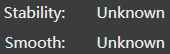
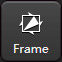

- [Координаты.](#координаты)
- [Начало работы.](#начало-работы)
- [Создание программы.](#создание-программы)
- [Запуск программы.](#запуск-программы)
- [Окончание работы.](#окончание-работы)
- [Обслуживание.](#обслуживание)
- [Разное.](#разное)
- [Медиа.](#медиа)

# Координаты.

**X** - Длинная сторона стола

**Y** - Короткая сторона стола

# Начало работы.

1. Включить вводной автомат (коробка на стене справа от станка).
2. Проверить уровень жидкости (с тыльной стороны шкафа) в системе жидкостного охлаждения (шкаф с вентилятором на крыше [*Chiller*]). Летом вода, зимой 30% раствор спирта.
3. Включить стабилизатор напряжения (большой автомат внутри шкафа, сам шкаф справа от чиллера).
4. Включить станок (сзади станка красная круглая рукоятка, повернуть на 90гр. по часовой стрелке).
5. Запустить ПО **BodorThinker**.
6. Вкрутить редуктор, открыть баллон с газом, установить редуктором нужное давление (O2 = 8атм, N2 = 16атм). O2 для стали и нержавейки, N2 для алюминия и нержавейки. Можно открыть сразу оба баллона, станок выберет нужный газ в соответствии с заданным газом в в настройках **Layer** . Настройка давления N2 (O2 не настраивать!!!):
   1. Один оператор выставляет 20атм на редукторе.
   2. Второй оператор на станке включает продувку N2.
   3. В этот момент давление N2 упадет и первый оператор подстраивает редуктор на 16атм.
   4. Продувку прекращают (в общей сложности второй оператор продувает 3-4 секунды) и давление само вырастет до 20атм.
   5. В результате давление во время работы будет 16атм, а во время простоя 20атм.
7. Продуть газ перед началом работы  или  (2-3 сек) (для заполнения магистралей или для выдувания неправильного газа из общей магистрали). На концах магистралей с газами стоят эл.магн. клапаны, после них идет одна общая магистраль к голове лазера, в которой либо не будет газа перед началом работы, либо может быть неправильный газ, оставшийся после предыдущей работы станка (забыли стравить газ перед выключением станка).
8. Открыть **Layer**  и импортировать параметры резки для нужного металла (есть фильтры по толщине, материалу).
9. Убедиться, что в голове станка установлен нужный тип сопла (одинарное или двойное), размер сопла (1.0 ... 3.0), открыт нужный вид газа (O2 или N2).
10. Положить лист метала (можно маленький кусочек) для калибровки.
11.  подать питание на источник лазерного излучения.
12.  TODO? (МОЖЕТ Beam?) включить красный лазер для отображения положения головы на листе.
13. Установить голову станка в ноль по X,Y,Z кнопка **Go Home** . Движение в ноль по команде с пульта значительно быстрее.
14. Передвинуть голову на лист (не калибровать на углу листа).
15. Калибровка емкостного датчика высоты Z головы над поверхностью:
    1. С пульта, **калибровка одной кнопкой**, быстрее но не видно результатов калибровки на экране (можно задать авто-отображение результатов после окончания калибровки).
    2. В ПО:
       1. Нажать иконку **Follow** . Появится окно калибровки.
       2. Опустить голову на поверхность кнопкой **Follow** .
       3. Поднять голову на 5-10мм над поверхностью кнопкой **Z+**  в ПО или на пульте **Z↑**.
       4. Начать калибровку кнопкой **Calibrate** .
       5. По окончании в окне над графиком будут две строки с результатом, должно быть *отлично* или *хорошо* .
16. Отодвинуть голову и положить лист метала (заготовка).

# Создание программы.

1. Установить голову в начало координат кнопкой **Go Home** .
2. Нажать иконку **Nest** .
3. Импортировать детали: DXF или NCEX (может уже содержать список деталей, листов? и готовое размещение?).
4. Задать количество деталей, щелканув на деталь в списке.
5. Прямо в детали (дважды щелкнув ее) задать *перемычки* c *врезкой* (если требуется), иконка **M-Joint**  (включить *Micro-joint add leadline*).
6. Опционально прямо в детали задать *врезку*, иконка **Lead** . Лучше это сделать сразу для всех деталей за один раз уже после их размещения на листе.
7. Разместить детали на листе (Nest -> Do nesting...):
    1. Задать точный (до мм) размер листа (Plate) (если лист будет длиннее, при обрезке остатков останется перемычка (не дорежет), если меньше - станок будет резать рабочий стол? или остановится, т.к. датчик высоты покажет, что под головой нет листа).
    2. Задать отступ от края листа (обпил) (Plate Margin): 10мм (если меньше, сопло головы может удариться об упоры для листа на рабочем столе!!!).
    3. Задать расстояние между деталями (Part Space): 5мм?
    4. Задать порядок заполнения листа (Start Pos): нижний-правый (ноль станка и упоры справа, возле монитора).
    5. Опционально задать авто-обрезку листа для получения ровных отходов (Generate Remnant) (без остаточных выступов):
       1. Тип отходов (Remnant Type): L-образные, T-образные, прямоугольные.
       2. Отступ от деталей, на котором будет произведен рез (Cut Distance) для выравнивания отходов: 3мм. Отступ должен быть равен или больше длины *врезки* (если врезка делается под 90гр, иначе длину врезки нужно умножить на синус градуса врезки, чтобы получить расстояние начала врезки от кромки детали) в деталь!!! Иначе, при последующих операциях с деталями, ПО будет ругаться, что линии реза пересекаются и их нужно корректировать (появится окно с соответствующим предложением).
    6. Запустить размещение.
    7. Если детали не влезли на один лист, появится столько листов, сколько нужно.
8. Задать *врезку* сразу для всех деталей (выделить **Ctrl+A**), иконка **Lead** :
    1. *Lead-in -> Type*: Line
    2. *Lead-in -> Angle*: 90гр.
    3. *Lead-in -> Length*: 3мм.
    4. *Seal -> Gap*: 1мм? (для маленьких деталей можно не ставить *перемычки*, а ограничится недорезанием основного контура).
    5. И прочие параметры по вкусу.
9. Откорректировать направление врезки (изнутри или снаружи контура), иконка : *Контурная резка (Fill)* или *Плоттерная резка (Unfill)* определяет направление врезки снаружи (*fill* внутреннюю "полезную" область) или внутри (*unfill* внутреннюю "отходную" область) контура детали. Есть автоматический режим
10. Проверить правильность направления всех *врезок*.
11. Иконка  позволяет очистить добавленные элементы в контуре (*врезки*, *перемычки* и прочее).
12. Установить голову в начало координат, кнопка **Go Home** .

# Запуск программы.

1. Кнопка **Frame**  заставит голову станка описать в воздухе необходимые габариты листа (и его положение), которые нужны для выполнения текущей программы (проверка, влезут ли детали на лист метала, который лежит на столе).
2. Кнопка **Trace**  запустит передвижение головы без включения лазера (для проверки программы).
3. Кнопка **Simu**  запустит симуляцию программы на ПО, голова не двигается, лазер не включается.
4. Кнопка **▶** запустит программу резки.
5. После окончания, можно вручную разрезать металл на остатки кнопкой **Cut Sheet** .
6. Кнопка **Select**  позволяет резать только выделенный контур. Если кнопка нажата, но не выделен ни один контур, появится ошибка (перевод ужасен) при запуске программы. Выделяем контуры, нажимаем кнопку (она остается нажатой) и запускаем программу на выполнение.

# Окончание работы.

1. Закрыть баллоны с газом. Выкрутить редукторы (вывести пружину из работы).
2. Продуть газы O2 и N2 в станке, сняв остаточное давление в магистралях.
3. Выключить ПК.
4. Выключить станок.
5. Выключить стабилизатор напряжения.
6. Выключить вводной автомат.

# Обслуживание.

1. Фокусные и коллиматорные линзы заменяются сервисным центром.
2. Чистка защитного стекла: специальная шелковая тряпочка без ворсы, жидкостью для протирки оптики, сжатый воздух для сдува пылинок перед непосредственной установкой оправы со стеклом в голову (стекло в оправку вставляется туго).
3. Центровка луча лазера (на сопле диаметром 3мм для лучшей визуализации).
   1. Наклеить скотч на сопло.
   2. Нажать кратковременно кнопку **Laser**  (эта кнопка вручную включает лазер!!!).
   3. Лазер сделает отверстие в скотче. Снимаем скотч и смотрим, в центре отверстие или нет.
   4. Юстируем луч по X и Y шестигранником на голове.
4. Чистка\замена керамического кольца-держателя для сопла (влияет на емкостной датчик высоты?). Применяется для предотвращения перегрева нижних частей лазерной головки. При установке сквозь кольцо должна пройти проволочка емкостного датчика высоты.

# Разное.

Положительный фокус для кислорода и отрицательный для азота TODO?

1. В станке нету защитного газа (хотя кнопки есть).
2. *Chiller* постоянно включен (чтобы случайно не перегреть оптоволоконный лазерный источник внутри станка и голову станка).
3. При недостаточном уровне охлаждающей жидкости чиллер будет пищать.
4. *ПО* - под этой аббревиатурой скрывается встроенная оболочка **BodorThinker** для работы со станком.
5. По умолчанию для деталей на экране станка относительное начало координат находится в текущих координатах головы станка. Т.е. если деталь на экране отображается в начале координат стола станка, а голова станка находится в центре стола, то при запуске резки голова сразу опустится и начнет вырезать деталь!!!.
6. Вся работа с деталями выполняется только после их выделения **Ctrl+A** или выделения индивидуального контура.
7. При включении лазера на металле появится оплывшее отверстие (и соответственно на кромке детали - половина оплывшего отверстия). Станок *пробивает* метал лазерным лучом и только после этого начинает движение. Чтобы избежать *пробития* на контуре детали, задают *врезку*: лазер включается в стороне от детали, *пробивает* метал и начинает рез в направлении контура детали, далее по контуру детали. Оплывшее отверстие остается в отходах. Чтобы деталь не выпадала, можно задать, чтобы лазер не дорезал контур до самого конца. Годится для маленьких деталей, но не годится для больших, т.к противоположная сторона длинной детали остается не закрепленной и будет подыматься, опускаться или появится пузо в центре детали. Для больших деталей можно автоматически или вручную задать *перемычку* в нескольких местах контура детали, НО лазер в начале перемычки выключится и снова включится в конце перемычки - появится оплывшее отверстие!!! Нужно задавать *перемычки* с *врезкой*. Без перемычек деталь может начать прыгать при резке, появится куча искр, оплывы с изнаночной стороны, лазер заедет в деталь лучом и прочее. Некоторые в этот момент придерживают деталь (с нарушением ТБ?), чтобы не скакала во время резки.
8. *Врезка* - *Lead*, *LeadLine*.
9.  На пульте кнопка **Улитка\Олень** задает скорость ручного перемещения (стрелки на пульте) головы станка.
10. На пульте кнопка **Пила и две стрелки вправо под пилой** включает\выключает пошаговое ручное перемещение (стрелки на пульте) головы станка.
11. Если станок остановили во время выполнения программы, можно кнопками **⏪** и **Fn+⏪** (активирует **⏩**) перемещать голову станка по контуру реза (перемотка программы вперед и назад). Перемотав программу, можно возобновить работу с кнопкой **Resume**  (дорезав неразрезанную деталь или пропустив ненужную деталь).
12. При первом перемещении головы после включения станка по X или Y может произойти рассинхронизация энкодеров. Станок начнет вибрировать и издавать характерные звуки заклинивания направляющих, как будто направляющие заедают то с одной стороны, то с другой. В этом случае остановить перемещение. Полностью выключить станок (электрическую часть) и включить снова. Перемещение должно стать нормальным.
13. Вместо кислорода можно применять обычный воздух, винтовой компрессор отечественного производства на 15атм стоит 6500$.
14.  включить вручную вентилятор вытяжки (в настройках задано автоматическое включение при начале резки).
15.  блокирует ПО, пароль **123456**.
16. Имея DXF файл можно заранее открыть его в ПО на ПК и добавить *врезку*, *перемычки* с *врезками* и прочее что нужно. Сохранить в NCEX и открывать уже готовую деталь в ПО в станке, удобнее и быстрее.

# Медиа.

Пульт (TODO расписать кнопки):

Одинарное сопло:

Двойное сопло:

Чиллер:

Оптоволоконный лазерный источник Maxphotonics:

Устройство головы:

