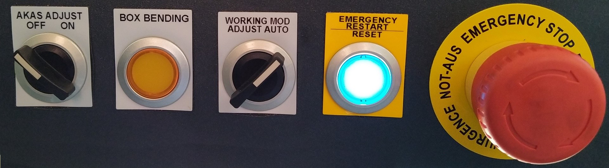

- [Оси станка](#оси-станка)
- [Пультовый терминал](#пультовый-терминал)
- [Запуск станка](#запуск-станка)
- [Световая защита](#световая-защита)
- [Разное](#разное)

# Оси станка

- **Y1/Y2** - левый/правый цилиндры верхней балки (при виде спереди).
- **X1/X2** - глубина упоров.
- **R1/R2** - высота упоров.
- **C** - бомбирование.

# Пультовый терминал

1. **AKAS ADJUST [OFF]/[ON]**: включает луч лазера для настройки световой защиты
1. **BOX BENDING**: однократно отключает световую защиту. Во время последнего шага операции гибки изделия в виде коробки, когда бока коробки перекрывают луч лазера сразу под пуансоном, станок останавливается по световой защите. Оператор нажимает эту кнопку и отключает световую защиту только для следующего шага гибки. Однако это неудобно, нужно подойти к пульту. Когда станок останавливается по световой защите, достаточно повторно нажать на педаль для продолжения операции гибки.
1. **WORKING MOD [ADJUST]/[AUTO]**: перевод станка в режим регулировки с отключением всех защит???
1. **[EMERGENCY RESTART]/[RESET]**:
    1. *Не горит*: нажата аварийная остановка на пульте или не педали. Отжать грибок.
    1. *Мигает*: станок находится в состоянии ошибки (написана в верхней строчке пульта???). Нажать на кнопку для сброса ошибки.
    1. *Светится*: станок готов к работе.
1. **EMERGENCY STOP**: аварийная остановка.

# Запуск станка

1. Включить главный выключатель на двери шкафа с правой стороны станка.
1. Автоматически откроется окно индексации.
1. Включить насос.
1. Провести индексацию осей согласно инструкции к станку. Непосредственно запуск операции совершается нажатием педали! Балка сразу подымается вверх, освобождая стояночные бревна.

# Световая защита

1. Включить лазерный луч защиты на пульте оператора **AKAS ADJUST ON**.
1. Отпустить барашек, опустить лазерный луч на 10мм ниже пуансона, зафиксировать барашком.
1. Два лазерных луча должны попадать в три отверстия приемного блока. На нем есть три светодиода, отображающих попадание луча.

# Разное

1. Во время операции выравнивания матрицы/пуансона величина **БОМБИРОВАНИЯ** должна быть равна **НУЛЮ**!, усилие прижатия 1 тонна для всей длины станка или порядка 200кг для короткого пуансона. Задается в **Numerical/Цифровой** окне.
1. Пароли для уровней доступа соответствуют номеру: 1, 2, 3.
1. Педаль оператора имеет два уровня нажатия: основной для опускания пуансона (нормальное нажатие) и аварийная остановка (полное нажатие до упора).
1. При срабатывании световой защиты повторное нажатие педали продолжает операцию гибки.
1. При поднятой световой защите балка перемещается со скоростью **LOW SPEED**.
1. Перед выключением опустить балку на два бруска.
